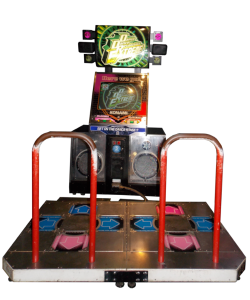

# DDRScoring

DDRScoring est une plateforme de scoring pour les jeux de type "DDR".

Dance Dance Révolution dit “DDR” est un jeu de rythme venu du Japon en 1998.
Il a connu un succès sur les bornes d’arcades avec une interface contrôlée par les mouvements des pieds.
   

<strong>Le but du projet</strong> est d’exploiter <strong>les fichiers de sauvegarde</strong> pour afficher une courbe de progression de la performance du joueur.
La plateforme sera conçue dans un soin d’évolutivité d’ajout de fichier de sauvegarde venant de tous jeux dit « DDR ».
  
<ul>
  <li>
    <strong>Le joueur</strong> peut envoyer un fichier de sauvegarde et consulter sa courbe de progression a traver une plateforme web. 
  </li>
  <li>
    <strong>Les développeurs</strong> de jeux de type « DDR » peuvent avoir un intérêt pour un site communautaire. 
    La plateforme intégrera une API entrante et sortante pour la consultation et la récupération des scores. 
  </li>
</ul>
 
Le site ne proposera pas de classement entre les joueurs pour éviter toutes trichent ; car le fichier importe ne dispose d’aucun moyen numérique permettant de prouve son authenticité.
Je considère que tous fichiers importés par le joueur peut être truqué.

